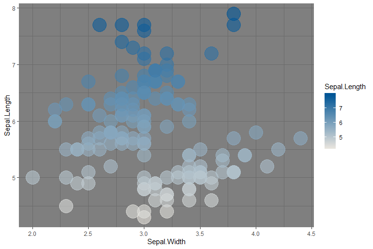

# defendersr
Defenders 
==========================================================================================

Defenders of Wildlife branded color palettes for use in developing scientific figures using ggplot. Modelled after @drismonj tutorial. Learn more at https://drsimonj.svbtle.com/creating-corporate-colour-palettes-for-ggplot2.

## Installation
For easy installation, use the `devtools` package

```r
install.packages("devtools")  # if you don't already have devtools installed; this may take several minutes
devtools::install_github("laceym14/defendersr")
```

## Functions
**Defenders of Wildlife:** `scale_color_defenders()`, `scale_fill_defenders()`

**Standard land ownership colors for mapping:** `scale_color_land()`, `scale_fill_land()`

**National Park Service map colors:** `scale_color_nps()`, `scale_fill_nps()`

**Color blind friendly color ramps:** `scale_color_cb()`, `scale_fill_cb()`

Determine what colors are available in each palette by calling `Defenders_colors()`, `land_ownership()`, `nps_colors()`, or `cb_colors()`. All color palettes are listed below.

## Examples
Some examples with ggplot:
```r
# install.packages("ggplot2") # if you don't already have ggplot2 installed
library(defendersr)
library(ggplot2)

ggplot(iris, aes(Sepal.Width, Sepal.Length, color = Species)) +
  geom_point(size = 4) +
  scale_color_defenders("warm") +
  theme_classic()
```


```r  
ggplot(iris, aes(Sepal.Width, Sepal.Length, color = Sepal.Length)) +
  geom_point(size = 10, alpha = .6) +
  scale_color_defenders(discrete = FALSE, palette = "cool gradient") +
  theme_dark()
```


```r  
ggplot(mpg, aes(manufacturer, fill = manufacturer)) +
  geom_bar() +
  theme(axis.text.x = element_text(angle = 45, hjust = 1)) +
  scale_fill_defenders(palette = "main", guide = "none")
```


  
```r  
ggplot(mtcars, aes(factor(cyl), mpg, fill = factor(am))) +
  geom_bar(stat = "identity", position = "dodge", color = "grey40") +
  scale_fill_defenders(palette = "classic", guide = "none") +
  ggtitle("Defenders of Wildlife Classic Color Palette") +
  theme_bw()
```


If you want a hex value for any color in the palettes offered, simply follow the examples below:
```r  
> Defenders_colors() # Get list of Defenders branding color hex codes
orange     brown       red    yellow   dkgreen   ltgreen      blue    purple      gray       tan 
"#e36f1e" "#b2740e" "#db1537" "#ffcf00" "#00583d" "#387c2b" "#005596" "#7a3777" "#e6e3dd" "#f4eedc"

> land_ownership() # Get list of standard land ownership colors
                                                              BLM                                               BLM Wilderness Area 
                                                        "#fee679"                                                         "#fecb5c" 
                                                             USFS                                              USFS Wilderness Area 
                                                        "#ccebc5"                                                         "#99d594" 
                                                              NPS                                               NPS Wilderness Area 
                                                        "#cabddc"                                                         "#b189c1" 
                                                        USFWS NWR                                             USFWS Wilderness Area 
                                                        "#7fcca7"                                                         "#66bf7f" 
                                              National Grasslands                                             Bureau of Reclamation 
                                                        "#e6f5b1"                                                         "#ffffb3" 
                                               Indian Reservation                                Indian Reservation Wilderness Area 
                                                        "#fdb46c"                                                         "#fd9a52" 
                     Military Reservations and Corps of Engineers                                                Other Federal Land 
                                                        "#fbb4ce"                                                         "#e4c49f" 
                                                       State Land                                             State Wilderness Area 
                                                        "#b3e3ee"                                                         "#6bcee2" 
State, County, City; Wildlife, Park, and Outdoor Recreation Areas                                                      Private Land 
                                                        "#8fb5be"                                                         "#ffffff" 

```

# Color palettes available
## Defenders of Wildlife Branding:


## National Park Service Maps:


## Color Blind Friendly Color Ramps:


# Hex values 
Each color palette incorporates its respective set of colors, hex values provided below:


## Defenders of Wildlife Branded Colors:
- Orange (#e36f1e)
- Brown (#b2740e)
- Red (#db1537)
- Yellow (#ffcf00)
- Dark green (#00583d)
- Light green (#387c2b)
- Blue (#005596)
- Purple (#7a3777)
- Gray (#e6e3dd)
- Tan (#f4eedc)

## Land Ownership Colors: 
- BLM (#fee679)
- BLM Wilderness Area (#fecb5c)
- USFS (#ccebc5)
- USFS Wilderness Area (#99d594)
- NPS (#cabddc)
- NPS Wilderness Area (#b189c1)
- USFWS NWR (#7fcca7)
- USFWS Wilderness Area (#66bf7f)
- National Grasslands (#e6f5b1)
- Bureau of Reclamation (#ffffb3)
- Tribal Land (#fdb46c)
- Tribal Land Wilderness Area (#fd9a52)
- Military and Corps of Engineers (#fbb4ce)
- Other Federal Land (#e4c49f)
- State Land (#b3e3ee)
- State Wilderness Area (#6bcee2")
- State Wildlife, Park, Outdoor Rec (#8fb5be)
- Private Land (#ffffff)

*(color selection based on https://www.ntc.blm.gov/krc/uploads/223/Ownership_Map_Color_Reference_Sheet.pdf)*

## National Park Service Map Colors:
- white (#f2f4f0)
- brown (#decbbc)
- green (#3d9c89)
- light green (#9db5a8)
- gray (#859391)
- blue (#c4e6f7)

## Color Blind Friendly Colors:
### Palette 1:
- red (#b2182b)
- peach (#ef8ab2)
- cream (#fddbc7)
- light blue (#d1e5f0)
- blue (#67a9cf)
- dark blue (#2166ac)
### Palette 2:
- orange red (#d73027)
- orange (#fc8d59)
- yellow (#fee090)
- light blue (#e0f3f8)
- blue (#91bfdb)
- dark blue (#4575b4)
### Palette 3:
- brown (#8c510a)
- light brown (#d8b365)
- tan (#f6e8c3)
- teal (#c7eae5)
- turquoise (#5ab4ac)
- green (#01665e)


